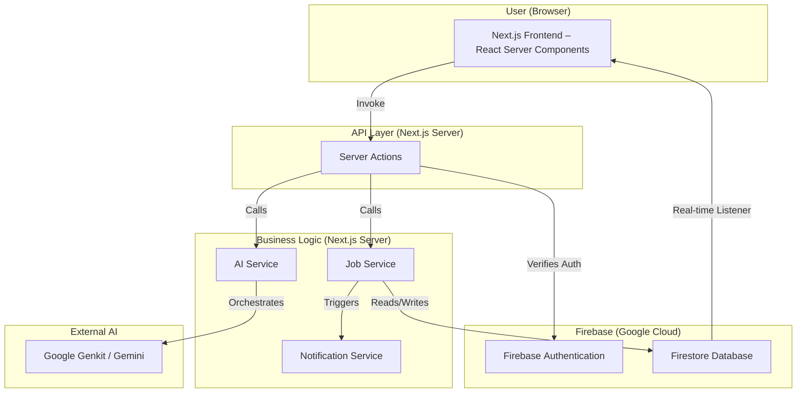

# PumpTracker Full‑Stack Architecture Document

## High Level Architecture

### Technical Summary

The PumpTracker application is a modern, serverless full‑stack application built on **Next.js 15** and the **Firebase** ecosystem. It leverages Next.js App Router and **Server Actions** to expose a type‑safe RPC layer, while **Firestore** provides real‑time persistence and **Firebase Authentication** manages identity. Advanced natural‑language functionality is powered by **Google Genkit**. This event‑driven, component‑based design favors scalability, real‑time collaboration, and rapid development.

### Platform & Infrastructure Choice

- **Platform:** Firebase (Hosting, Firestore, Authentication) & Google Cloud (Genkit/AI)
- **Key Services:** Firebase Hosting, Firestore, Firebase Authentication, Google AI Platform
- **Deployment Regions:** Firebase Hosting global CDN

### Repository Structure

- **Structure:** Monorepo
- **Monorepo Tool:** npm / yarn / pnpm workspaces
- **Package Organization:** Shared types live in `src/lib/types`

### Architecture Diagram



---

## Tech Stack

| Category           | Technology         | Version | Purpose                          | Rationale                                               |
| ------------------ | ------------------ | ------- | -------------------------------- | ------------------------------------------------------- |
| Frontend Language  | TypeScript         | 5.x     | Type safety across the stack     | Reduces runtime errors and improves DX                  |
| Frontend Framework | Next.js            | 15.x    | Full‑stack React framework       | App Router + Server Actions integrate front & back ends |
| UI Library         | ShadCN/ui          | latest  | Accessible base components       | Unstyled primitives easily themed with Tailwind         |
| Styling            | Tailwind CSS       | latest  | Utility‑first CSS framework      | Enables rapid, consistent styling without custom CSS    |
| Backend Language   | TypeScript         | 5.x     | Server‑side logic & shared types | One language across client/server simplifies dev        |
| API Style          | Server Actions     | n/a     | Type‑safe RPC                    | Removes need for separate REST/GraphQL layer            |
| Database           | Firebase Firestore | v9+     | NoSQL realtime database          | Scales automatically & integrates with Auth             |
| Authentication     | Firebase Auth      | v9+     | User auth/session                | Native Google provider, secure                          |
| AI Engine          | Google Genkit      | latest  | AI flow orchestration            | Simplifies building AI‑powered features                 |
| Frontend Testing   | Vitest             | latest  | Unit testing                     | Fast, Jest‑compatible                                   |
| E2E Testing        | Playwright         | latest  | Cross‑browser E2E                | Robust & reliable                                       |

---

## Data Models

The shared TypeScript interfaces in `src/lib/types` mirror the Firestore schema.

### `jobs` Collection

```typescript
type Priority = 'High' | 'Normal' | 'Low';
type JobStatus = 'Unscheduled' | 'Scheduled' | 'In Progress' | 'Delayed' | 'Requires Attention';

interface Job {
  id: string;            // Document ID
  model: string;
  customer: string;
  poNumber: string;
  priority: Priority;
  status: JobStatus;
  buildTime?: number;     // hours
  paintColor?: string;
  serialNumber?: string;
  scheduledDate?: Timestamp;
  createdAt: Timestamp;
  updatedAt: Timestamp;
}
```

### `users` Collection

```typescript
interface UserProfile {
  uid: string;   // Auth UID = Doc ID
  email: string;
  role: 'Admin' | 'Department Lead';
  displayName?: string;
  avatarUrl?: string;
}
```

### `audit_trails` Collection

```typescript
interface AuditLog {
  id: string;   // Document ID
  jobId: string;
  user: { uid: string; email: string };
  timestamp: Timestamp;
  action: 'CREATE' | 'UPDATE' | 'DELETE' | 'MOVE';
  changes: Array<{
    field: keyof Job;
    oldValue: unknown;
    newValue: unknown;
  }>;
}
```

---

## Unified Project Structure

```plaintext
/
├── src/
│   ├── app/
│   │   ├── (auth)/               # Auth routes
│   │   ├── (main)/               # Protected app routes
│   │   │   ├── dashboard/
│   │   │   │   └── page.tsx      # Main dashboard
│   │   │   └── layout.tsx
│   │   ├── layout.tsx            # Root layout
│   │   └── page.tsx              # Root page (redirect logic)
│   ├── components/
│   │   ├── ui/                   # ShadCN primitives
│   │   └── dashboard/            # Feature components
│   ├── lib/
│   │   ├── actions/              # Server Actions (jobActions.ts etc.)
│   │   ├── firebase/             # Firebase client/admin SDK
│   │   ├── genkit/               # Genkit flows
│   │   └── types/                # Shared interfaces
│   └── middleware.ts             # Auth & RBAC
├── .env.local                    # Env vars
├── next.config.mjs
└── tsconfig.json
```

---

## Security & Authentication

### Authentication Flow

1. Unauthenticated visit triggers middleware redirect to **/login**.
2. User selects “Login with Google”.
3. **Firebase Auth** handles OAuth popup/redirect.
4. On success the client receives a JWT; SDK auto‑refreshes tokens.
5. A matching `users` document is created if absent.
6. The client attaches the ID token with each **Server Action** invocation.

### Authorization (RBAC)

- **Server Actions** read the caller’s `UserProfile` to verify role before mutations.
- **Firestore Security Rules** enforce least privilege at the database level.
- **middleware.ts** protects routes based on auth state and role.

