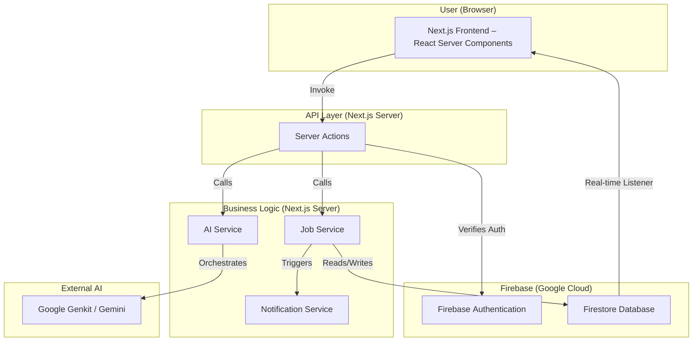

# High Level Architecture

## Technical Summary

The PumpTracker application is a modern, serverless full‑stack application built on **Next.js 15** and the **Firebase** ecosystem. It leverages Next.js App Router and **Server Actions** to expose a type‑safe RPC layer, while **Firestore** provides real‑time persistence and **Firebase Authentication** manages identity. Advanced natural‑language functionality is powered by **Google Genkit**. This event‑driven, component‑based design favors scalability, real‑time collaboration, and rapid development.

## Platform & Infrastructure Choice

- **Platform:** Firebase (Hosting, Firestore, Authentication) & Google Cloud (Genkit/AI)
- **Key Services:** Firebase Hosting, Firestore, Firebase Authentication, Google AI Platform
- **Deployment Regions:** Firebase Hosting global CDN

## Repository Structure

- **Structure:** Monorepo
- **Monorepo Tool:** npm / yarn / pnpm workspaces
- **Package Organization:** Shared types live in `src/lib/types`

## Architecture Diagram

---
