# Design Document

## Overview

The Pump Tracker is a real-time manufacturing job tracking system built as a progressive web application (PWA) with offline capabilities. The system uses a modern web stack with React/TypeScript frontend, Node.js/Express backend, PostgreSQL database, and integrates Google Gemini AI for natural language querying. The architecture supports real-time updates via WebSocket connections, mobile-responsive design, and robust offline synchronization.

## Architecture

### High-Level Architecture

```mermaid
graph TB
    subgraph "Client Layer"
        A[React PWA Frontend]
        B[Mobile App Interface]
        C[Offline Storage - IndexedDB]
    end

    subgraph "API Gateway"
        D[Express.js Server]
        E[WebSocket Server]
        F[Authentication Middleware]
    end

    subgraph "Business Logic"
        G[Job Management Service]
        H[Scheduling Service]
        I[Notification Service]
        J[AI Query Service]
    end

    subgraph "Data Layer"
        K[PostgreSQL Database]
        L[Redis Cache]
        M[File Storage]
    end

    subgraph "External Services"
        N[Google OAuth]
        O[Google Gemini AI]
        P[Email Service]
    end

    A --> D
    B --> D
    C --> A
    D --> F
    D --> E
    F --> N
    D --> G
    D --> H
    D --> I
    D --> J
    G --> K
    H --> K
    I --> P
    J --> O
    K --> L
    E --> A
    E --> B
```



### Technology Stack

**Frontend:**

- React 18 with TypeScript
- Material-UI for component library
- React DnD for drag and drop functionality
- Chart.js for data visualization
- Workbox for PWA and offline capabilities
- Socket.io-client for real-time updates

**Backend:**

- Node.js with Express.js
- TypeScript for type safety
- Socket.io for WebSocket connections
- Prisma ORM for database operations
- Google APIs for authentication and AI
- Node-cron for scheduled tasks

**Database & Storage:**

- PostgreSQL for primary data storage
- Redis for caching and session management
- IndexedDB for offline client storage

**Infrastructure:**

- Google Cloud Platform deployment
- Cloud SQL for PostgreSQL
- Cloud Storage for file exports
- Cloud Run for containerized services

## Components and Interfaces

### Frontend Components

#### Dashboard Component

```typescript
interface DashboardProps {
  user: User;
  filters: DashboardFilters;
}

interface DashboardFilters {
  customer?: string;
  department?: string;
  dateRange?: DateRange;
}
```

**Responsibilities:**

- Render collapsible sidebars with metrics panels
- Manage filter state and update child components
- Handle real-time data updates via WebSocket
- Coordinate between kanban board and calendar views

#### Kanban Board Component

```typescript
interface KanbanBoardProps {
  jobs: Job[];
  stages: ProductionStage[];
  onJobMove: (jobId: string, targetStage: string) => void;
  readOnly?: boolean;
}

interface Job {
  id: string;
  model: string;
  customer: string;
  poNumber: string;
  priority: Priority;
  buildTime: number;
  paintColor?: string;
  serialNumber?: string;
  currentStage: string;
  createdAt: Date;
  updatedAt: Date;
}
```

**Responsibilities:**

- Render draggable job cards in stage columns
- Handle drag and drop operations
- Validate stage transitions
- Queue operations when offline

#### Calendar Scheduler Component

```typescript
interface CalendarSchedulerProps {
  unscheduledJobs: Job[];
  scheduledJobs: ScheduledJob[];
  onJobSchedule: (jobId: string, startDate: Date) => void;
  onJobReschedule: (jobId: string, newStartDate: Date) => void;
}

interface ScheduledJob extends Job {
  scheduledStartDate: Date;
  estimatedEndDate: Date;
}
```

**Responsibilities:**

- Display timeline view with capacity visualization
- Handle job scheduling via drag and drop
- Show build time overlays and conflicts
- Calculate and display capacity utilization

#### AI Query Interface

```typescript
interface AIQueryProps {
  onQuery: (question: string) => Promise<AIResponse>;
  history: QueryHistory[];
}

interface AIResponse {
  answer: string;
  visualizations?: ChartData[];
  confidence: number;
  sources: string[];
}
```

**Responsibilities:**

- Provide natural language input interface
- Display AI responses with visualizations
- Maintain query history
- Handle loading and error states

### Backend Services

#### Job Management Service

```typescript
class JobManagementService {
  async createJob(jobData: CreateJobRequest): Promise<Job>;
  async updateJob(jobId: string, updates: Partial<Job>): Promise<Job>;
  async moveJob(
    jobId: string,
    targetStage: string,
    userId: string
  ): Promise<Job>;
  async getJobs(filters: JobFilters): Promise<Job[]>;
  async deleteJob(jobId: string): Promise<void>;
}
```

**Responsibilities:**

- CRUD operations for job management
- Stage transition validation and execution
- Audit trail creation for all changes
- Real-time event broadcasting

#### Scheduling Service

```typescript
class SchedulingService {
  async scheduleJob(jobId: string, startDate: Date): Promise<ScheduledJob>;
  async getSchedule(dateRange: DateRange): Promise<ScheduledJob[]>;
  async checkCapacity(date: Date): Promise<CapacityInfo>;
  async optimizeSchedule(jobs: Job[]): Promise<ScheduleOptimization>;
}

interface CapacityInfo {
  date: Date;
  totalCapacity: number;
  usedCapacity: number;
  availableCapacity: number;
  conflicts: ScheduleConflict[];
}
```

**Responsibilities:**

- Job scheduling and rescheduling logic
- Capacity calculation and conflict detection
- Schedule optimization algorithms
- Timeline generation for calendar view

#### AI Query Service

```typescript
class AIQueryService {
  async processQuery(
    question: string,
    context: QueryContext
  ): Promise<AIResponse>;
  async generateVisualization(
    data: any[],
    chartType: string
  ): Promise<ChartData>;
  private async buildContext(question: string): Promise<QueryContext>;
  private async callGeminiAPI(prompt: string): Promise<string>;
}

interface QueryContext {
  jobs: Job[];
  schedules: ScheduledJob[];
  metrics: ProductionMetrics;
  userRole: UserRole;
}
```

**Responsibilities:**

- Natural language query processing
- Context building from database
- Gemini AI API integration
- Response formatting and visualization generation

#### Notification Service

```typescript
class NotificationService {
  async sendVendorNotification(job: Job, vendor: Vendor): Promise<void>;
  async sendManagerAlert(alert: Alert): Promise<void>;
  async scheduleNotification(
    notification: ScheduledNotification
  ): Promise<void>;
  async getNotificationSettings(): Promise<NotificationSettings>;
}
```

**Responsibilities:**

- Email notification dispatch
- Alert generation and routing
- Notification scheduling and management
- Settings management

## Data Models

### Core Entities

#### Job Entity

```sql
CREATE TABLE jobs (
    id UUID PRIMARY KEY DEFAULT gen_random_uuid(),
    model VARCHAR(100) NOT NULL,
    customer VARCHAR(200) NOT NULL,
    po_number VARCHAR(100) NOT NULL,
    priority INTEGER NOT NULL DEFAULT 3,
    build_time INTEGER NOT NULL, -- in hours
    paint_color VARCHAR(50),
    serial_number VARCHAR(100),
    current_stage VARCHAR(50) NOT NULL DEFAULT 'unscheduled',
    scheduled_start_date TIMESTAMP,
    created_at TIMESTAMP DEFAULT NOW(),
    updated_at TIMESTAMP DEFAULT NOW(),
    created_by UUID REFERENCES users(id),
    UNIQUE(po_number, serial_number)
);
```

#### Audit Trail Entity

```sql
CREATE TABLE audit_trail (
    id UUID PRIMARY KEY DEFAULT gen_random_uuid(),
    job_id UUID REFERENCES jobs(id),
    user_id UUID REFERENCES users(id),
    action VARCHAR(50) NOT NULL,
    old_values JSONB,
    new_values JSONB,
    timestamp TIMESTAMP DEFAULT NOW(),
    ip_address INET,
    user_agent TEXT
);
```

#### Production Stages Entity

```sql
CREATE TABLE production_stages (
    id UUID PRIMARY KEY DEFAULT gen_random_uuid(),
    name VARCHAR(100) NOT NULL UNIQUE,
    order_index INTEGER NOT NULL,
    department VARCHAR(100),
    estimated_duration INTEGER, -- in hours
    is_external BOOLEAN DEFAULT FALSE,
    vendor_id UUID REFERENCES vendors(id)
);
```

### Relationships

- Jobs have many audit trail entries (1:N)
- Jobs belong to one current stage (N:1)
- Users create and modify jobs (N:N through audit trail)
- Stages can have many jobs (1:N)
- Vendors can be associated with external stages (1:N)

## Error Handling

### Client-Side Error Handling

**Network Errors:**

- Implement exponential backoff for API retries
- Queue operations locally when offline
- Display connection status indicator
- Graceful degradation of real-time features

**Validation Errors:**

- Client-side validation before API calls
- Clear error messages with suggested fixes
- Form field highlighting for invalid inputs
- Prevent invalid drag and drop operations

**State Management Errors:**

- Redux error boundaries for component isolation
- Automatic state recovery from localStorage
- Conflict resolution for concurrent updates
- Optimistic updates with rollback capability

### Server-Side Error Handling

**Database Errors:**

- Connection pool management with retry logic
- Transaction rollback for data consistency
- Deadlock detection and retry mechanisms
- Backup and recovery procedures

**External Service Errors:**

- Circuit breaker pattern for AI API calls
- Fallback responses when Gemini is unavailable
- Email service failover mechanisms
- OAuth authentication error handling

**Business Logic Errors:**

- Validation middleware for all endpoints
- Custom error classes with appropriate HTTP codes
- Detailed error logging with correlation IDs
- Rate limiting and abuse prevention

## Testing Strategy

### Unit Testing

- Jest for JavaScript/TypeScript testing
- React Testing Library for component tests
- 90% code coverage target
- Mock external dependencies (AI API, database)

### Integration Testing

- Supertest for API endpoint testing
- Database integration tests with test containers
- WebSocket connection testing
- Authentication flow testing

### End-to-End Testing

- Playwright for browser automation
- Critical user journey testing
- Mobile responsiveness testing
- Offline functionality testing
- Cross-browser compatibility testing

### Performance Testing

- Load testing with Artillery
- Database query optimization
- Bundle size monitoring
- Real-time update performance
- Mobile performance profiling

### Security Testing

- OWASP security scanning
- Authentication and authorization testing
- SQL injection prevention testing
- XSS and CSRF protection validation
- Data encryption verification

## Deployment and Infrastructure

### Development Environment

- Docker Compose for local development
- Hot reloading for frontend and backend
- Local PostgreSQL and Redis instances
- Mock services for external dependencies

### Production Environment

- Google Cloud Run for containerized services
- Cloud SQL for PostgreSQL with read replicas
- Cloud Memorystore for Redis
- Cloud Storage for file exports and backups
- Cloud CDN for static asset delivery

### CI/CD Pipeline

- GitHub Actions for automated testing
- Automated security scanning
- Database migration management
- Blue-green deployment strategy
- Automated rollback capabilities

### Monitoring and Observability

- Application performance monitoring
- Error tracking and alerting
- Database performance monitoring
- Real-time system health dashboards
- User analytics and usage tracking
